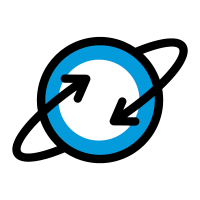

<!--
*** Using markdown "reference style" links for readability.
*** https://www.markdownguide.org/basic-syntax/#reference-style-links
-->
[![Issues][issues-shield]][issues-url]
[![MIT License][license-shield]][license-url]


<!-- PROJECT LOGO -->
<br />
<p align="center">
  <a href="https://github.com/desi109/linkio-space">
    
    
  </a>

  <h3 align="center">Linkio.Space</h3>

  <p align="center">
    Linkio.Space is a web application that allows you to keep all your connections with people and their business cards. <br>You can easily and quickly add new links. All your business cards are stored and updated at any time.
    <br />
    <a href="https://github.com/desi109/linkio-space"><strong>Explore the docs »</strong></a>
    <br />
    <br />
    <a href="https://github.com/desi109/linkio-space">View Demo</a>
    ·
    <a href="https://github.com/desi109/linkio-space/issues">Report Bug</a>
    .
    <a href="https://github.com/desi109/linkio-space/issues">Request Feature</a>
  </p>
</p>


<!-- TABLE OF CONTENTS -->
<details open="open">
  <summary><h2 style="display: inline-block">Table of Contents</h2></summary>
  <ol>
    <li>
      <a href="#about-the-project">About The Project</a>
      <ul>
        <li><a href="#built-with">Built With</a></li>
      </ul>
    </li>
    <li>
      <a href="#getting-started">Getting Started</a>
      <ul>
        <li><a href="#prerequisites">Prerequisites</a></li>
        <li><a href="#installation">Installation</a></li>
      </ul>
    </li>
    <li><a href="#usage">Usage</a></li>
    <li><a href="#roadmap">Roadmap</a></li>
    <li><a href="#license">License</a></li>
    <li><a href="#contact">Contact</a></li>
  </ol>
</details>


<!-- ABOUT THE PROJECT -->
## About The Project

[![Product Name Screen Shot][product-screenshot]](https://linkio.space)

Here's a blank template to get started:
**To avoid retyping too much info. Do a search and replace with your text editor for the following:**
`github_username`, `repo_name`, `twitter_handle`, `email`, `project_title`, `project_description`


### Built With

* [Spring Boot](https://spring.io/projects/spring-boot)
* [PostgreSQL](https://www.postgresql.org/)
* [Vue](https://vuejs.org/)
* [Vuetify](https://vuetifyjs.com/en/)


<!-- GETTING STARTED -->
## Getting Started

To get a local copy up and running follow these simple steps.

### Prerequisites

This is an example of how to list things you need to use the software and how to install them.
* npm
  ```sh
  npm install npm@latest -g
  ```

### Installation

1. Clone the repo
   ```sh
   git clone https://github.com/desi109/linkio-space.git
   ```
2. Install NPM packages
   ```sh
   npm install
   ```


<!-- USAGE EXAMPLES -->
## Usage

Use this space to show useful examples of how a project can be used. Additional screenshots, code examples and demos work well in this space. You may also link to more resources.

_For more examples, please refer to the [Documentation](https://example.com)_


<!-- ROADMAP -->
## Roadmap

See the [open issues](https://github.com/desi109/linkio-space/issues) for a list of proposed features (and known issues).


<!-- LICENSE -->
## License

Distributed under the MIT License. See `LICENSE` for more information.


<!-- CONTACT -->
## Contact
[![LinkedIn][linkedin-shield]][linkedin-url] 

Project Link: [https://github.com/desi109/linkio-space](https://github.com/desi109/linko-space)


<!-- MARKDOWN LINKS & IMAGES -->
<!-- https://www.markdownguide.org/basic-syntax/#reference-style-links -->
[issues-shield]: https://img.shields.io/github/issues/github_username/repo.svg?style=for-the-badge
[issues-url]: https://github.com/desi109/linkio-space/issues
[license-shield]: https://img.shields.io/github/license/github_username/repo.svg?style=for-the-badge
[license-url]: https://github.com/desi109/linkio-space/blob/master/LICENSE.md
[linkedin-url]: https://www.linkedin.com/in/desislava-milusheva-200574151
[product-screenshot]: images/screenshot.png

